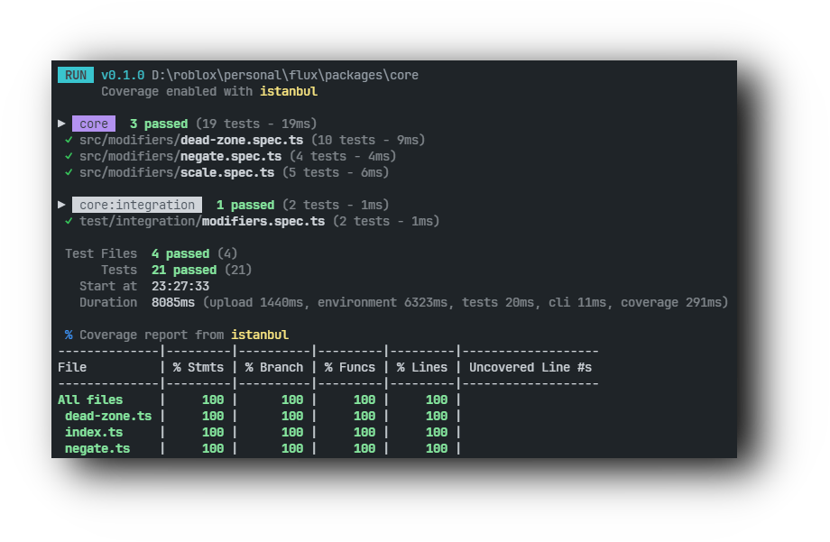

<h1 align="center">jest-roblox-cli</h1>

<p align="center">
  <a href="https://www.npmx.dev/package/@isentinel/jest-roblox"></a>
  <a href="https://github.com/christopher-buss/jest-roblox-cli/actions/workflows/ci.yaml"></a>
  <a href="https://github.com/christopher-buss/jest-roblox-cli/blob/main/LICENSE"></a>
</p>

Run your roblox-ts and Luau tests inside Roblox, get results in your terminal.

<p align="center">
  
</p>

- roblox-ts and pure Luau
- Source-mapped errors (Luau line numbers back to `.ts` files)
- Code coverage (in-process Luau AST instrumentation)
- Three backends: Open Cloud (remote), Studio (attached, local), and Studio CLI
  (self-launched headless Studio, local)
- Multiple output formatters (human, agent, JSON, GitHub Actions)
- Live stage progress, so a long upload or dispatch never looks stalled

<!-- prettier-ignore -->
> [!NOTE]
> roblox-ts projects currently require
> [@isentinel/roblox-ts](https://npmx.dev/package/@isentinel/roblox-ts) for
> source maps and coverage support.

## Install

```bash
npm install @isentinel/jest-roblox
```

Type tests need
[@typescript/native-preview](https://npmx.dev/package/@typescript/native-preview),
an optional peer dependency. Install it only if you run `--typecheck` or
`--typecheckOnly`; runtime tests do not use it.

```bash
npm install -D @typescript/native-preview
```

### Standalone binary (no Node.js required)

Pre-built binaries are attached to each
[GitHub release](https://github.com/christopher-buss/jest-roblox-cli/releases).
Install with your preferred tool manager:

```bash
mise use github:christopher-buss/jest-roblox-cli
rokit add christopher-buss/jest-roblox-cli

```

Limitations vs the npm package:

- `--typecheck` and `--typecheckOnly` are not available
- `.ts` config files are not supported (use `.json`, `.js`, or `.mjs`)
- External tools (rojo) must still be on your `PATH`

## Quick start

Add a `jest.config.ts` (or `.js`, `.json`, `.yaml`, `.toml`) to your project
root:

```typescript
import { defineConfig } from "@isentinel/jest-roblox";

export default defineConfig({
	placeFile: "./game.rbxl",
	test: {
		projects: ["ReplicatedStorage/shared"],
	},
});
```

Then run:

```bash
jest-roblox
```

<!-- prettier-ignore -->
> [!NOTE]
> `projects` is optional. With it omitted, the CLI derives one project per
> `luauRoots` mount (the compiled-output dirs your Rojo project mounts,
> auto-detected from your tsconfig `outDir`), generating each project's
> `jest.config` stub for you. Set `projects` explicitly when you need
> per-project overrides (a distinct `displayName`, `setupFiles`, `include`,
> etc.) or a tighter project layout than the luau roots imply.

## Usage

```bash
# Run all tests
jest-roblox

# Run one file (TypeScript or Luau)
jest-roblox src/player.spec.ts
jest-roblox src/player.spec.luau

# Filter by test name
jest-roblox -t "should spawn"

# Filter by file path
jest-roblox --testPathPattern player
jest-roblox --testPathPattern="modifiers|define\\.spec|triggers"

# Use a specific backend (default "auto" picks Studio if the plugin is
# connected, else Open Cloud if credentials are set — see Backends below)
jest-roblox --backend studio
jest-roblox --backend studio-cli
jest-roblox --backend open-cloud

# Collect coverage
jest-roblox --coverage

# Save game output (print/warn/error) to file
jest-roblox --gameOutput game-logs.txt

# Run only specific named projects
jest-roblox --project client
```

## Configuration

Config files are loaded by [c12](https://github.com/unjs/c12), which
auto-discovers `jest.config.*` in any format it supports (`.ts`, `.js`, `.mjs`,
`.cjs`, `.json`, `.yaml`, `.toml`).

Configs can extend a shared base with `extends`:

```typescript
export default defineConfig({
	extends: "../../jest.shared.ts",
	test: {
		projects: ["ReplicatedStorage/shared"],
	},
});
```

Precedence: CLI flags > config file > extended config > defaults.

### Root config fields

Two distinct buckets live at the root level. Jest passthrough fields live under
`test:` (see "Test fields" below).

#### Workspace Run Options

Atomic to one invocation — these describe what the run targets and how the CLI
presents output, not how any individual package runs. In `--workspace` mode they
resolve as: CLI flag > unanimous per-package declaration > default. Mixed
per-package declarations error loudly.

| Field                  | What it does                                                                                                                                                        | Default       |
| ---------------------- | ------------------------------------------------------------------------------------------------------------------------------------------------------------------- | ------------- |
| `backend`              | `"auto"`, `"open-cloud"`, `"studio"`, or `"studio-cli"`                                                                                                             | `"auto"`      |
| `color`                | Use ANSI colors in console output                                                                                                                                   | `true`        |
| `formatters`           | Output formatters (`"default"`, `"agent"`, `"json"`, `"github-actions"`)                                                                                            | `["default"]` |
| `gameOutput`           | Write Game Output to a file — a path, or `true` for `game-output.log` under the root. In `--workspace` mode this is one grouped aggregate file across every package | —             |
| `outputFile`           | Write the Jest result JSON — a path, or `true` for `jest-output.log` under the root. In `--workspace` mode this is the single merged result across every package    | —             |
| `workspace.exclude`    | Globs (workspace-root-relative) naming package directories an enumerated run must skip; `--packages` overrides it                                                   | —             |
| `workspace.gameOutput` | `true` to also emit per-package Game Output files under `.jest-roblox/output/` (`--workspace` only)                                                                 | —             |
| `workspace.outputFile` | `true` to also emit per-package result files under `.jest-roblox/output/` (`--workspace` only)                                                                      | —             |
| `parallel`             | Concurrent Open Cloud sessions, or `"auto"` (= `min(jobs, 3)`). studio-cli is serial: it runs one session for any of unset, `1`, or `"auto"`                        | —             |
| `placeId`              | Open Cloud place ID                                                                                                                                                 | —             |
| `port`                 | WebSocket port for Studio backend                                                                                                                                   | `3001`        |
| `silent`               | Suppress console output                                                                                                                                             | `false`       |
| `studioPath`           | Roblox Studio executable for the `studio-cli` backend (auto-detected if unset; also `--studioPath` / `JEST_ROBLOX_STUDIO_PATH`)                                     | —             |
| `universeId`           | Open Cloud universe ID                                                                                                                                              | —             |

#### Per-package fields

Loaded per package (directly or via `extends: "../jest.shared.ts"`). The
workspace-root config is NOT a source of truth for these — declare them in each
package's own jest.config or in a shared config that every package extends.

| Field              | What it does                                                      | Default                     |
| ------------------ | ----------------------------------------------------------------- | --------------------------- |
| `placeFile`        | Path to your `.rbxl` file                                         | `"./game.rbxl"`             |
| `timeout`          | Max time for tests to run (ms)                                    | `300000` (5 min)            |
| `sourceMap`        | Map Luau errors back to TypeScript (roblox-ts only)               | `true`                      |
| `rojoProject`      | Path to your Rojo project file                                    | auto                        |
| `jestPath`         | Where Jest lives in the DataModel                                 | auto                        |
| `showLuau`         | Show Luau code snippets in failure output                         | `true`                      |
| `coverageCache`    | Reuse incrementally-instrumented coverage shadow dir between runs | `true`                      |
| `uploadCache`      | Skip the place upload when the place file's bytes are unchanged   | `true`                      |
| `luauRoots`        | Where Luau files live for coverage instrumentation                | auto from tsconfig `outDir` |
| `bootProbeTimeout` | How long the boot probe is given to prove a place version starts  | `90000` (90 s)              |

A coverage run does not mirror a whole `luauRoot`. It resolves your coverage
universe against the file system first and mirrors only the directories that
actually hold a covered file, which on a large project is a small fraction of
the tree. A Rojo `$path` mount that lands on such a directory is repointed at
the shadow; a mount _above_ one is demoted instead — its `$path` moves to a copy
of that directory's own loose files and the narrowed directory is hung
underneath as an explicit child, so its unprobed siblings keep loading from your
`outDir` rather than being copied.

That makes a `luauRoot` above, at, or below a `$path` mount all work. Only a
root no mount reaches at all reports nothing, and the run says so by name.

Narrowing steps aside when it would not pay: a config whose covered files are
scattered across a wide tree keeps most of the mount whichever way it is split,
so the mount is taken whole instead of buying a project node per sibling.

`timeout` is the deadline Roblox is given for the script, not a hard cap on the
run. Roblox starts that clock when the script begins running — after the place
boots — so a run that overruns waits a short fixed allowance past the deadline
for Roblox's verdict, and reports the error Roblox gives rather than a poll
timeout.

`bootProbeTimeout` covers the Open Cloud backend's boot probe: after uploading a
place, it runs one trivial script against that version before dispatching any
tests. Roblox reports no state, no error and no log for a place version it
cannot start, so without the probe such a run only ends when its budget does. A
probe that does not finish in time fails the run at once, naming the place file
and the version. This is wall clock, so it must comfortably exceed a cold place
boot (10-45 s); the probe script gets its own short deadline on top, so a place
that boots late still gets to run. A version that passes is recorded in
`.jest-roblox/upload-cache.json`, so re-running the same place bytes skips the
probe (see `uploadCache`). Set it to `0` to turn the probe off — a suite that
proves the boot elsewhere, say once per CI job, need not pay for it on every
run. Nothing is then cached either: an entry means "these bytes boot", and with
no probe nothing has proved that.

### Test fields

Put these under `test: { ... }`.

| Field                    | What it does                                     | Default                              |
| ------------------------ | ------------------------------------------------ | ------------------------------------ |
| `projects`               | Where to look for tests in the DataModel         | one project per `luauRoots` mount    |
| `testMatch`              | Glob patterns that find test files               | `**/*.spec.ts`, `**/*.test.ts`, etc. |
| `testPathIgnorePatterns` | Patterns to skip                                 | `/node_modules/`, `/dist/`, `/out/`  |
| `setupFiles`             | Scripts to run before the test environment loads | —                                    |
| `setupFilesAfterEnv`     | Scripts to run after the test environment loads  | —                                    |
| `verbose`                | Show individual test results                     | `false`                              |
| `silent`                 | Suppress console output                          | `false`                              |

### Coverage fields

Put these under `test: { ... }`.

| Field                        | What it does                             | Default                                       |
| ---------------------------- | ---------------------------------------- | --------------------------------------------- |
| `collectCoverage`            | Turn on coverage                         | `false`                                       |
| `coverageDirectory`          | Where to write coverage reports          | `"coverage"`                                  |
| `coverageReporters`          | Which report formats to use              | `["text", "lcov"]`                            |
| `coverageThreshold`          | Minimum coverage to pass                 | —                                             |
| `coveragePathIgnorePatterns` | Files to leave out of coverage           | test files, `node_modules`, `rbxts_include`   |
| `collectCoverageFrom`        | Globs for files to include in coverage   | —                                             |
| `coverageCopyIgnorePatterns` | Files to leave out of the coverage place | `**/*.d.ts`, `**/*.d.ts.map`, `**/*.luau.map` |

<!-- prettier-ignore -->
> [!NOTE]
> Coverage uses vitest `all` / Istanbul semantics: every instrumented
> file matching the include globs is reported, so a source file with no test
> shows **0%** (and fails `coverageThreshold`) instead of being silently
> omitted. When `collectCoverageFrom` is unset for a multi-project run, the
> include universe is derived from each project's `include` globs, excluding
> `*.spec`/`*.test` and `*.client`/`*.server` entry-point scripts (which compile
> to LocalScript/Script and can't be `require`d, so no test can cover them).
> In workspace mode `collectCoverageFrom` globs resolve against the package's
> own `rootDir`, so a package at `packages/foo` writes `src/**/*.ts` for its own
> sources no matter which directory the CLI was invoked from. Single and multi
> runs anchor on the invocation directory.

<!-- prettier-ignore -->
> [!TIP]
> The same universe decides what gets probes. A file outside it is copied into
> the coverage place unprobed, so the run never carries hit counts the report
> would discard — which is what keeps a large project under Open Cloud's 4 MiB
> limit on a task's return value. Narrowing `collectCoverageFrom` is therefore
> the lever to pull on `OUTPUT_SIZE_LIMIT_EXCEEDED`. Workspace mode has no
> derived fallback, so a package that sets nothing probes its whole
> `luauRoots`.

`coverageCopyIgnorePatterns` is the other half of that: it decides what the
coverage place carries at all, not what the report covers. A coverage run
mirrors the covered directories into a shadow tree and builds the place from
that, and the default drops the three sidecars roblox-ts emits beside every
module. rojo mounts none of those extensions, and every reader of a source map
opens the one in `outDir` — the stack mapper resolves `$path` from your own rojo
project, not the synthesized one — so on a large project they are roughly three
quarters of the copied files.

Patterns match a path relative to its compiled root, directories included, and
they are matched exactly (no substring containment) because an over-match drops
something the runtime needs. An ignored path is never probed either, so a
pattern naming a `.luau` keeps that module out of the place entirely.

The mirror descends neither `node_modules` nor a dot-prefixed directory, which
is what every walk in the pipeline does — nothing inside one is probed, and
nothing inside one reaches the coverage place. A subtree the place has to load
belongs under a `$path` mount of its own, outside any `luauRoot`.

Narrowing never steps aside on a mount this list touches. A pattern naming the
mount's only covered module leaves nothing to narrow towards, and taking the
mount whole is what keeps the module out: the shadow is the one tree it is
missing from, so a mount left on your `outDir` would serve it anyway.

Declare a function to keep the defaults and add to them:

```ts
export default defineConfig({
	test: {
		coverageCopyIgnorePatterns: (defaults) => {
			return [...defaults, "**/*.tsbuildinfo"];
		},
	},
});
```

Passing an array replaces the defaults outright; `[]` copies everything.

### Project-level config

`projects` can be strings (DataModel paths) or objects with per-project
overrides:

```typescript
import { defineConfig, defineProject } from "@isentinel/jest-roblox";

export default defineConfig({
	placeFile: "./game.rbxl",
	test: {
		projects: [
			defineProject({
				test: {
					displayName: { name: "client", color: "magenta" },
					include: ["**/*.spec.ts"],
					mockDataModel: true,
					outDir: "out/src/client",
				},
			}),
			defineProject({
				test: {
					displayName: { name: "server", color: "white" },
					include: ["**/*.spec.ts"],
					outDir: "out/src/server",
				},
			}),
		],
	},
});
```

### Full example

```typescript
import { defineConfig } from "@isentinel/jest-roblox";

export default defineConfig({
	backend: "open-cloud",
	jestPath: "ReplicatedStorage/Packages/Jest",
	placeFile: "./game.rbxl",
	test: {
		collectCoverage: true,
		coverageThreshold: {
			branches: 70,
			functions: 80,
			statements: 80,
		},
		projects: ["ReplicatedStorage/client", "ServerScriptService/server"],
	},
	timeout: 60000,
});
```

## Backends

Three ways to run tests, plus an auto-pick:

### Auto (default)

`--backend auto` (the default) probes for a connected Studio plugin first. If a
plugin matching this release answers, runs via Studio; otherwise falls back to
Open Cloud — but only if credentials are available (see Open Cloud below). With
no plugin and no credentials, the run errors instead of silently falling back.

A plugin that connects but reports a different protocol version is an error
rather than a fallback — see
[Several plugins installed](#several-plugins-installed).

### Open Cloud (remote)

Uploads your place file to Roblox and polls for results.

You need these environment variables:

| Variable                    | What it is                   |
| --------------------------- | ---------------------------- |
| `ROBLOX_OPEN_CLOUD_API_KEY` | Your Open Cloud API key      |
| `ROBLOX_UNIVERSE_ID`        | The universe to run tests in |
| `ROBLOX_PLACE_ID`           | The place to run tests in    |

> Prefix any of the above with `JEST_` (e.g. `JEST_ROBLOX_PLACE_ID`) to override
> the unprefixed value. Use the `JEST_`-prefixed form when the generic names
> collide with other tooling.

#### Required scopes

Create the API key in the Creator Dashboard against the target universe, then
grant it the scopes below. A `403` at runtime surfaces as a `PermissionError`
with the missing scope name.

Always required:

| Scope                                         | What it's for                                    |
| --------------------------------------------- | ------------------------------------------------ |
| `universe-places:write`                       | Publish the built `.rbxl` as a new place version |
| `universe.place.luau-execution-session:write` | Start the Luau session that runs the tests       |

A sharding `--workspace` run — `--parallel auto` or an explicit count above 1 —
additionally requires the queue scopes for work-stealing across concurrent
sessions. Without them the run warns and falls back to one task at a time:

| Scope                                              | What it's for                                  |
| -------------------------------------------------- | ---------------------------------------------- |
| `memory-store.queue:add` / `:dequeue` / `:discard` | Work-stealing queue across concurrent sessions |

A sharding `--workspace` run with a streaming formatter additionally requires:

| Scope                                     | What it's for                                           |
| ----------------------------------------- | ------------------------------------------------------- |
| `memory-store.sorted-map:read` / `:write` | Stream live per-package results back as packages finish |

Streaming is enabled by default and disabled only for `--silent`,
`--formatters json`, and `--formatters agent` (without `--verbose`).
`--formatters agent --verbose` re-enables streaming and therefore still needs
the sorted-map scopes; `--formatters github-actions` also streams.

### Studio (local)

Connects to Roblox Studio over WebSocket. Faster than Open Cloud (no upload
step), but Studio must be open with the plugin running. Studio doesn't expose
which place is open, so multiple concurrent projects aren't supported yet.

<!-- prettier-ignore -->
> [!NOTE]
> For `--coverage`, prefer `--backend open-cloud` since the coverage
> output is built to a separate output under `.jest-roblox/coverage/` that is
> likely not the studio place being served.

Install the plugin with [Drillbit](https://github.com/jacktabscode/drillbit):

#### Configuration file

Create a file named drillbit.toml in your project's directory.

```toml
[plugins.jest_roblox]
github = "https://github.com/christopher-buss/jest-roblox-cli/releases/download/v0.3.21/JestRobloxRunner.rbxm"
```

Then run `drillbit` and it will download the plugin and install it in Studio for
you.

Or download `JestRobloxRunner.rbxm` from the
[latest release](https://github.com/christopher-buss/jest-roblox-cli/releases)
and drop it into your Studio plugins folder.

#### Several plugins installed

Studio runs every plugin in your plugins folder, so a leftover copy of an older
`JestRobloxRunner` opens its own connection alongside the current one. Each
connection announces its protocol version, and the CLI runs on one that speaks
the protocol this release speaks — the others are left alone. The release
numbers need not match; the protocol is the compatibility contract, so a plugin
from a neighbouring release that speaks the same protocol serves the run.

When no connection speaks it, the run stops before building a place and names
every connection it found:

```text
No compatible jest-roblox Studio plugin. This CLI speaks protocol v6, and the 2 plugin connection(s) on this port report:
  - JestRobloxRunner 0.3.18 (protocol v5)
  - a plugin that sent no handshake (it predates the handshake entirely)
Install the JestRobloxRunner.rbxm shipped with jest-roblox 0.3.21, and remove the other copies from your Studio plugins folder.
```

This is an error even when Open Cloud credentials are set: a plugin that cannot
serve the run is something to fix, not a reason to switch backend.

`--backend studio-cli` cannot make this choice. It drives the plugin through Run
mode rather than a socket, every installed copy gets its own runner, and
`StudioTestService:EndTest` is first-past-the-post — a copy that refuses the
version answers in milliseconds while the copy that can serve the run is still
running your suite. Copies from this release onwards stand down for one that has
claimed the run, but a copy predating it answers regardless. **Keep exactly one
`JestRobloxRunner` in your plugins folder if you use `studio-cli`.**

### Studio CLI (self-launched, local)

`--backend studio-cli` owns the whole Studio lifecycle: it builds its own place,
launches Roblox Studio headless via Studio's `--task RunScript` interface,
drives the installed plugin's Run mode, reads the result from Studio's output
log, and quits Studio. No API key, no upload, no pre-opened editor — you just
need Studio installed (logged in) with the jest plugin. It spawns its own
isolated Studio instance, so any editor you already have open is untouched.

It is selected only when you ask for it explicitly — `auto` never launches a
Studio process on its own. Studio is auto-discovered per-OS; override the
executable with `studioPath` (config key), `--studioPath`, or
`JEST_ROBLOX_STUDIO_PATH`. The backend is serial: `--parallel auto` resolves to
one session, and an explicit `--parallel > 1` errors.

Pass `--headed` to show the Studio window during the run instead of the default
hidden one — useful for watching a slow run or a hang (Studio still self-quits
when tests finish, so a fast run just flashes). It is a per-run debugging flag,
CLI-only and inert on every other backend.

Once the result lands, Studio is shut down gracefully: it is allowed to close
the place — running any edit-mode plugin `BindToClose` handlers and freeing the
place lock — and is then killed the instant the lock releases, skipping Studio's
slow telemetry teardown. The shutdown is decoupled from the result, so pass/fail
prints immediately and the process exits once teardown finishes.

Unlike the attached `studio` backend, `--coverage` works here: studio-cli opens
the Coverage-Instrumented Place instead of the Clean Place, so the report
universe, thresholds, reporters, and exclusions behave identically to the
open-cloud backend (including the all-files semantics where an untested included
file reports **0%** and fails `coverageThreshold`).

<!-- prettier-ignore -->
> [!NOTE]
> studio-cli is a local-developer convenience backend (it needs a logged-in
> Studio and the installed plugin), not a CI path.

### Experimental: in-session VM parallelism

`--experimental-vm-parallel [n]` runs a multi-project suite across `n` Luau VMs
inside the one Studio session instead of one project after another. Bare, it
asks for one VM per project, capped at the four `Actor` hosts the plugin ships
(they are declared in its rojo project, so the pool is fixed when the plugin is
built); an explicit `n` above that cap is rejected rather than quietly reduced.
Both Studio backends drive it (`studio` and `studio-cli`) — Open Cloud rejects
it, because an Open Cloud session runs no scripts to host a second VM (use
`--parallel` there to shard across sessions), and workspace mode rejects it too.

Each host is an `Actor` in the plugin's own tree, so each project gets its own
`_G`, its own module cache, and its own copy of Jest. That is what makes the
overlap safe where running the projects concurrently in one VM is not: Jest
keeps its run state (the circus describe tree, expect's matcher state) in
VM-globals.

Two caveats come with it, both inherent rather than temporary:

- **Game output becomes batch-scoped.** `LogService.MessageOut` reports every
  message to every listener with no source identity, so once projects overlap
  nothing can say which project printed a line. The `--gameOutput` file writes
  one group labelled `"project": "(all projects)"`, `"scope": "batch"` instead
  of one group per project. The label follows what the run did rather than what
  it asked for: a run that collapses to a single VM (one project, or
  `--experimental-vm-parallel 1`), or one where no VM host was ready and the
  plugin fell back to running the projects in turn, keeps per-project groups.
- **The DataModel is still shared.** Projects that mutate `Workspace`,
  `ReplicatedStorage`, `Players`, or a DataStore mock conflict when they
  overlap, however the runner behaves. Turn this on for suites you know are
  DataModel-disjoint.

Projects whose runtime `jest.config` mounts nest — `ReplicatedStorage` and
`ReplicatedStorage/Foo` — are always assigned to the same host, and so still run
one after another. Their config stubs must never sit in the DataModel at the
same time, or Jest's parent-traversal config lookup resolves the wrong project's
config.

A host that fails or stops answering yields ExecutionError entries for its own
projects only; the other hosts' results come back normally. The plugin stops
waiting inside the run timeout it was given (`--timeout`, 300s by default), so
those partial results still reach you rather than arriving after the CLI has
given up.

## Workspace mode

Run tests across multiple packages in a pnpm workspace in a single invocation.
Works on every backend: Open Cloud (fans packages across parallel tasks),
`studio-cli` (one self-launched Studio process drives every package, no
sharding), and the attached `studio` backend (runs the workspace inside an open
Studio — handy for debugging the flow). `studio-cli` is serial, so
`--parallel auto` runs one session and an explicit count above 1 is rejected
with `--workspace`.

<!-- prettier-ignore -->
> [!NOTE]
> Package discovery uses one of two sources. By default it takes the pnpm
> workspace: the project list pnpm records at install time, falling back to
> `pnpm-workspace.yaml` when that record is missing or older than the file. Both
> count the root `package.json` as a package whether or not `packages:` lists
> `.`, matching pnpm. A package in a dot-directory resolves only from the
> recorded list, so run `pnpm install` after adding one. Alternatively, declare a
> `workspace` block in your jest config (see
> [Workspaces without pnpm](#workspaces-without-pnpm)) to enumerate packages by
> glob — this works in Luau-only, npm, and yarn repos. Either source honours `!`
> exclusion entries, and either way a package joins the run by carrying a
> `jest.config.*`; a library with no tests is not selected.
> `--affected-since` always delegates change detection to `turbo` or
> `nx` and is not yet wired for the `workspace.packages` source. When using Nx,
> each project's Nx name must match the `package.json` `name` field —
> `--affected-since` returns Nx project names and looks them up against the
> package list, so a mismatch surfaces as
> `Package "<name>" not found in workspace`.

A bare `--workspace` runs every package in the workspace. The two selection
flags narrow that set rather than enabling it, as does naming a file (see
[Naming files](#naming-files)):

```bash
# Every package
jest-roblox --workspace

# Specific packages
jest-roblox --workspace --packages @scope/pkg-a,@scope/pkg-b

# Everything changed since a git ref (via turbo/nx affected)
jest-roblox --workspace --affected-since main
```

`--packages` and `--affected-since` are mutually exclusive, and either flag
requires `--workspace`. A `--workspace` that selects nothing exits 2 — an empty
workspace is a configuration problem, while `--affected-since` finding nothing
is a clean run and exits 0.

### Naming files

A positional file narrows a workspace run the same way it narrows a
single-package one, and it narrows all the way down: only the packages and
projects whose `include` roots own the file are staged into the synthesized
place, and each runs that file alone.

```bash
# Only the package that owns this file, only this file
jest-roblox --workspace src/shared/dropdown.spec.ts
```

Paths are relative to the directory you run from, so the same argument works
from a package subdirectory. (Outside `--workspace` the base is the config's
`rootDir` instead — a workspace has no single one to use.) A file no package
owns is an error listing the include roots that were searched: naming a file
that nothing matches is a typo, not a clean run. Ownership is by include root,
so a file under a root that several projects include selects all of them.

Naming a `*.spec-d.ts` selects the type pass instead, and naming a runtime spec
leaves the package's Type Tests out. `--project` still applies first: it decides
which projects may run at all, and the file picks from what survives — so naming
a file none of those projects owns is the same error, where outside
`--workspace` the named projects would each be handed the file regardless.

### Excluding packages

`workspace.exclude` keeps a package out of a run that did not name it. Globs are
relative to the workspace root and match package directories:

```ts
export default defineConfig({
	workspace: {
		exclude: ["test/fixtures/**"],
	},
});
```

This is for packages the package manager has to install but the test run must
never pick up — a test fixture with real `workspace:*` dependencies has to stay
a workspace member, and dropping it from `pnpm-workspace.yaml` would break its
dependency links.

The exclude applies to enumeration only: a bare `--workspace` and
`--affected-since` both honour it, while `--packages @scope/fixture` still runs
it, because naming a package is asking for it.

### Failing fast

`--bail` stops the run at the first failing package instead of testing the rest:

```bash
jest-roblox --workspace --packages @scope/pkg-a,@scope/pkg-b --bail
```

The packages that never ran are left out of the report, which ends with how far
the run got:

```text
     Bailed  after 2 packages, 5 not run
```

A package counts as run once any of its projects ran, so a package the bail
caught part-way through is not reported as skipped.

The exit code is the usual `1` — a bail is a test failure that ended the run
early, not an error in its own right.

Under `--parallel`, the task that fails announces it through a MemoryStore
signal map the wave shares, and its siblings stop before taking their next
package. Open Cloud cannot cancel a task from outside, so a package already
running finishes and reports; the bail stops the ones after it.

That map is written and read inside the Roblox session, so it needs no extra
API-key scopes — the `memory-store.sorted-map` scopes below are for the CLI's
own streaming reads, which `--bail` does not require.

Workspace mode and Open Cloud only. `--bail` without `--workspace`, or with a
Studio backend, is rejected rather than quietly running the whole batch.

This is not Jest's `bail`. `test.bail` in your config still counts failing test
suites inside a single package and is passed through to Jest untouched.

### Workspaces without pnpm

`pnpm-workspace.yaml` isn't required. Declare a `workspace` block in a shared
config and have every package extend it:

```ts
// packages/testing/jest.shared.ts
import { defineConfig } from "@isentinel/jest-roblox";

export default defineConfig({
	workspace: {
		packages: ["packages/*"], // globs relative to root
		root: "../..", // relative to THIS file; resolved at load
	},
	// shared jest options…
});
```

```ts
// packages/foo/jest.config.ts
export default { extends: "../testing/jest.shared.ts" };
```

`workspace.root` and `workspace.packages` must be declared together. `root` is
resolved to an absolute path relative to the file that declares it (the shared
config), so it points at the same directory no matter which package you run
from. Each glob in `packages` selects directories that contain a
`jest.config.*`; the package name comes from `package.json#name`, falling back
to the directory name (so Luau-only packages need no `package.json`). A `.` glob
selects the workspace root itself, the same as a `packages: - .` entry in
`pnpm-workspace.yaml`. Every selected package must resolve the same
`workspace.packages`/`root` — inheriting from one shared config guarantees this,
and a package that overrides or omits it fails the run.

Run from inside any package as usual. To run from a directory with no resolvable
jest config (e.g. the repo root), either point at the shared config with
`--workspace-root`:

```bash
jest-roblox --workspace --packages foo --workspace-root packages/testing
```

or add a re-export at the repo root so the config is discovered there:

```ts
// jest.config.ts (repo root)
export { default } from "./packages/testing/jest.shared.ts";
```

Coverage reports per package. Each opted-in package gets its own report, built
from its own `collectCoverageFrom` and `coveragePathIgnorePatterns`, rendered by
its own `coverageReporters`, into its own `<rootDir>/<coverageDirectory>` — its
`rootDir` being the package directory, so the report lands beside the package.

Coverage is opt-in per package (each package's own `collectCoverage`), and
`coverageThreshold` is enforced per package: every opted-in package is gated
against its own files, by the threshold it declared itself. A package that
declares none is not gated — there is no run-level threshold to inherit, since
the file at the directory you happen to run from is not a source of truth. There
is no pooled cross-package gate either, so one package's high coverage cannot
mask another's shortfall. Declaring a threshold without `collectCoverage` prints
a warning: it cannot be enforced without instrumentation.

Game Output has two independent sinks. Setting `gameOutput` (a path, or `true`)
writes one **grouped** aggregate file at the workspace root —
`[{ package, project, entries }]`, one group per (package, project) that ran.
Setting `workspace.gameOutput: true` writes a **per-package** file per (package,
project) under `.jest-roblox/output/`. Either, both, or neither may be set; with
both, humans see the aggregate announced and agents see the per-package paths.

Each capture opens before its package is materialized and closes after Jest's
teardown, and holds only that package's output (a package with several projects
carries the materialize-time slice on its first project's entry; Destroy-time
output from the reset between packages is attributed to neither side). A package
that fails also has its Game Output printed under its own section of the
terminal report, so no file needs opening to tell which package printed which
warning.

`outputFile` (the Jest result JSON) follows the same two-sink model:
`outputFile` (a path, or `true`) writes one merged result at the workspace root,
and `workspace.outputFile: true` writes a per-package result file per (package,
project) under `.jest-roblox/output/`.

## CLI flags

| Flag                             | What it does                                                                                                                                              |
| -------------------------------- | --------------------------------------------------------------------------------------------------------------------------------------------------------- |
| `--backend <type>`               | Choose `auto`, `open-cloud`, `studio`, or `studio-cli`                                                                                                    |
| `--port <n>`                     | WebSocket port for Studio                                                                                                                                 |
| `--studioPath <path>`            | Roblox Studio executable for `studio-cli` (auto-detected if unset)                                                                                        |
| `--headed`                       | Show the Studio window during the run (`studio-cli` only; default: hidden)                                                                                |
| `--config <path>`                | Path to config file                                                                                                                                       |
| `--testPathPattern <regex>`      | Filter test files by path                                                                                                                                 |
| `-t, --testNamePattern <regex>`  | Filter tests by name                                                                                                                                      |
| `--formatters <name...>`         | Output formatters (`default`, `agent`, `json`, `github-actions`)                                                                                          |
| `--outputFile <path>`            | Write results to a file                                                                                                                                   |
| `--gameOutput <path>`            | Write game print/warn/error to a file                                                                                                                     |
| `--coverage`                     | Collect coverage                                                                                                                                          |
| `--no-coverage`                  | Disable coverage for this run, even when enabled in config                                                                                                |
| `--coverageDirectory <path>`     | Where to put coverage reports                                                                                                                             |
| `--coverageReporters <r...>`     | Which report formats to use                                                                                                                               |
| `--collectCoverageFrom <glob>`   | Globs for files to include in coverage (repeatable)                                                                                                       |
| `--no-show-luau`                 | Hide Luau code in failure output                                                                                                                          |
| `-u, --updateSnapshot`           | Update snapshot files                                                                                                                                     |
| `--sourceMap`                    | Map Luau errors to TypeScript (roblox-ts only)                                                                                                            |
| `--rojoProject <path>`           | Path to Rojo project file                                                                                                                                 |
| `--timeout <ms>`                 | Max time for tests to run                                                                                                                                 |
| `--passWithNoTests`              | Exit `0` when no test files are found                                                                                                                     |
| `--verbose`                      | Show each test result                                                                                                                                     |
| `--silent`                       | Hide all output                                                                                                                                           |
| `--no-color`                     | Turn off colors                                                                                                                                           |
| `--no-coverage-cache`            | Force a clean coverage re-instrumentation                                                                                                                 |
| `--no-upload-cache`              | Always upload the place, even when its bytes are unchanged                                                                                                |
| `--parallel [n]`                 | Open Cloud concurrent sessions, or `auto` (= `min(jobs, 3)`); one session on studio-cli                                                                   |
| `--experimental-vm-parallel [n]` | Studio-only: run the projects across `n` Luau VMs in one session (see [Experimental: in-session VM parallelism](#experimental-in-session-vm-parallelism)) |
| `--project <name...>`            | Filter which named projects to run                                                                                                                        |
| `--setupFiles <path...>`         | Scripts to run before env                                                                                                                                 |
| `--setupFilesAfterEnv <path...>` | Scripts to run after env                                                                                                                                  |
| `--typecheck`                    | Run type tests too                                                                                                                                        |
| `--typecheckOnly`                | Run only type tests                                                                                                                                       |
| `--typecheckTsconfig <path>`     | tsconfig for type tests                                                                                                                                   |
| `--workspace`                    | Run every package in the workspace; narrow it with `--packages`, `--affected-since`, or a positional file (see [Workspace mode](#workspace-mode))         |
| `--bail`                         | Workspace mode: stop at the first failing package (see [Failing fast](#failing-fast))                                                                     |
| `--packages <names>`             | Comma-separated package names; narrows a workspace run                                                                                                    |
| `--affected-since <ref>`         | Run only packages affected since a git ref (workspace mode)                                                                                               |
| `--apiKey <key>`                 | Open Cloud API key (prefer env vars in CI — visible in process listings)                                                                                  |
| `--universeId <id>`              | Target universe ID (Open Cloud)                                                                                                                           |
| `--placeId <id>`                 | Target place ID (Open Cloud)                                                                                                                              |

## How it works

1. Finds files matching `testMatch` patterns
2. Builds a `.rbxl` via Rojo
3. Sends the place to Roblox (Open Cloud upload or Studio WebSocket)
4. Parses Jest JSON output from the session
5. Maps Luau line numbers to TypeScript via source maps (roblox-ts only)
6. Prints results

Every step up to the tests announces itself under the `RUN` header, with what it
is working on — the size of the place going up, the version that booted, the
number of projects dispatched — so a slow one says which it is. A terminal gets
one block, repainted in place with a running duration; a pipe, a redirect and a
CI log get a line as each step starts and another as it ends. Either way the
block stops there and stays put: the results, the summary and the coverage
report are the run saying where it is from then on. `--silent`,
`--formatters json` and `--formatters agent` report no stages at all.

<!-- prettier-ignore -->
> [!NOTE]
> Coverage adds extra steps: copy Luau files, insert tracking probes,
> build a separate place file, then map hit counts back to source. For
> roblox-ts, this goes through source maps to report TypeScript lines.

## Test file patterns

Default `testMatch` patterns (configurable):

- TypeScript: `*.spec.ts`, `*.test.ts`, `*.spec.tsx`, `*.test.tsx`
- Luau: `*.spec.lua`, `*.test.lua`, `*.spec.luau`, `*.test.luau`
- Type tests: `*.spec-d.ts`, `*.test-d.ts`

## Contributing

See [CONTRIBUTING.md](CONTRIBUTING.md).

## License

MIT
